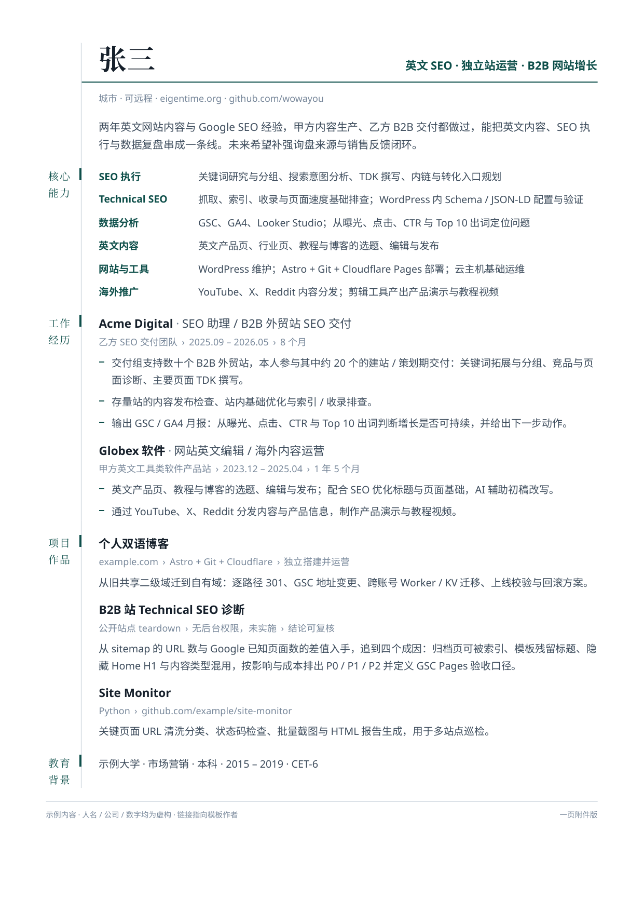

# onepage-resume

[](https://github.com/wowayou/onepage-resume/actions/workflows/render.yml)
[](LICENSE)

**填空式**的一页简历生成器：`python fill.py` 一题一题地问，问完直接出 PDF / HTML / PNG。
不想被问就 `python fill.py --blank` 拿一份空白表单，在编辑器里把每个空填上。
想边填边看版面就 `python webui.py`，浏览器里左边填字、右边实时看 A4（只听本机）。

答案存成 TOML，版面用 CSS 排——内容和版式始终是分开的两个文件。

排版交给 WeasyPrint 的 CSS 盒模型，间距由引擎计算——不手工算坐标，所以不会出现
"标题压住上一段文字"这种事。内容超过一页时程序**报错拒绝生成**，不会偷偷给你第二页。



> 上图是仓库里的 `content.example.toml` 渲染出来的。人名、公司、数字全是编的；
> 顶部那两条链接是模板作者的（[eigentime.org](https://eigentime.org) ·
> [github.com/wowayou](https://github.com/wowayou)），当署名用，你自己那份换掉就行。

## 它适合谁

- 想要一份克制、能过 ATS、黑白打印也清楚的一页简历（中文、英文都行）；
- 不想从零排版，也不想被在线编辑器绑住：回答一串问题就有一份 PDF；
- 愿意把内容和版式分开：改内容只动 TOML，调版式只动 `theme.toml`；
- 需要按岗位做多个定制版，而且**不想让真实姓名手机邮箱进 Git**。

不适合：需要多页、需要花哨图形、需要在线编辑器的场景。

---

## 隐私模型（先读这段）

这个仓库是公开的，所以它被设计成**工具和数据分离**：

| | 在哪 | 进 Git 吗 |
|---|---|---|
| 程序、版式、设计令牌 | 本仓库 | ✅ 跟踪 |
| `content.example.toml` 虚构示例 | 本仓库 | ✅ 跟踪 |
| **你的真实内容** `content.toml` | 本仓库目录内，或仓库外任意路径 | ❌ 被 `.gitignore` 挡住 |
| `fill.py` 留的备份 `content.toml.bak` | 内容文件旁边 | ❌ 被 `.gitignore` 挡住 |
| **生成物** `build/` | 本仓库 `build/` 或你指定的目录 | ❌ 被 `.gitignore` 挡住 |

四道防线：

1. `.gitignore` 里是 `content*.toml` + `!content.example.toml`——**除了示例，任何
   内容文件都进不去**。按公司做定制版叫 `content.acme.toml` 也一样安全。
   `*.toml.bak` 另有一条：`content.toml.bak` 后缀变了，不匹配 `content*.toml`，
   而备份里装的是一模一样的真实内容。
2. `build/` 整个目录忽略。PDF 的正文是可被全文搜索的，手机号进了 Git 历史就得重写
   历史才删得掉。
3. `./scripts/check-privacy.sh`（= `make check`）在提交前扫一遍**被跟踪的**文件里
   有没有手机号、真实邮箱、私人内容文件或生成物。

   再建一个 `.identifiers` 文件（已在 .gitignore 里），一行一个写上你的姓名、
   个人域名、雇主名，改示例时手滑粘了真东西进去会被当场拦住：

   ```bash
   cat > .identifiers <<'EOF'
   张三
   yourdomain.com
   某某科技有限公司
   EOF
   ```

   有些标识是你**故意**公开的——比如示例简历里当署名的个人域名。这种在竖线右边
   列出允许出现的文件（空格分隔），出现在别处照样报错：

   ```
   yourdomain.com | content.example.toml
   ```

   ⚠️ **不要把这些串写进脚本本身**——脚本是公开仓库的一部分，写进去等于亲手
   公开你本想拦截的东西。`.identifiers` 存在才做这项检查，不存在就跳过。

4. **预览图不许过期。** README 顶部那张 `examples/preview.png` 是渲染产物：改了示例
   内容或版式却忘了重渲，README 上就会一直挂着旧内容。`examples/preview.sha256`
   记着四份输入（`content.example.toml` + `theme.toml` + `resume.css` + `render.py`）的哈希，
   对不上 `make check` 就报错。改完示例跑一次 `make preview`，它会重渲、覆盖图片、
   更新哈希，两个文件一起提交。

**更稳的做法**：把真实内容文件放在本仓库之外（比如另一个私有仓库、或
`~/.private/resume/me.toml`），用 `--content` 指过来。这样连"误改 .gitignore"
这条路都堵死了：

```bash
python render.py --content ~/.private/resume/me.toml --out-dir ~/.private/resume/build
```

---

## 开箱即用

在没装过任何东西的机器上（Debian / Ubuntu / WSL2，或 macOS + Homebrew），只要仓库
在手上，**一条命令就绪**：

```bash
git clone https://github.com/<你的账号>/onepage-resume.git
cd onepage-resume

make boot
```

`make boot` 依次做三件事，**幂等**（重复跑不会坏事）：

1. `scripts/bootstrap.sh` —— 自动探测包管理器，把 WeasyPrint 要的系统库和 CJK 字体
   装齐（**缺才装**，不会反复跳出来要 sudo）；非交互、没有 sudo 时会打印手动命令而不是卡死。
2. `make setup` —— 建 `.venv` 并装 Python 依赖。
3. `make example` —— 渲染虚构示例冒烟。`build/example/resume.pdf` 出来就说明环境通了。

然后挑一种填法开始（见下），最后 `make render` 出你自己的 PDF。

### 已经在 WSL 里了，怎么起？

不用碰 `start.cmd`，它是给「从 Windows 那边进来」用的。在 WSL 终端里就是两条：

```bash
cd ~/onepage-resume
make boot      # 只有第一次要跑（幂等，重复跑不会坏事）
make ui        # 以后每次就这一条
```

`make ui` 会自己去开 Windows 那边的浏览器（走 `wslview` 或 `powershell.exe`）。
开不成它会把网址再打一遍，手工点开 `http://127.0.0.1:8765` 一样用。

**原生 Windows 用户**：装好 WSL2 + 一个 Ubuntu 发行版后，**双击仓库根目录的
`start.cmd`** 即可——它会自动进 WSL 跑完上面三步，等端口通了再打开浏览器。
仓库放在哪都行，两种位置它都认：

- **在 WSL 里**（`\\wsl.localhost\<发行版>\home\...`，推荐、也更快）：它会把这个
  UNC 路径拆回「发行版名 + Linux 路径」，用 `wsl -d <发行版> --cd /home/...` 进去。
- **映射成了网络驱动器**（比如 `Z:\home\...` 指向 `\\wsl.localhost\Ubuntu-24.04`）：
  也认。`wsl` 自己认不了盘符（会说 `Failed to translate 'Z:\...'`），所以脚本先用
  `net use` 把盘符还原成 UNC，再按上一条处理。
- **在 Windows 盘上**（`C:\...`）：能用，但要经 `/mnt/c` 绕一圈，I/O 慢、实时预览迟钝。

走的是 WSL2 默认开着的 `localhostForwarding`；被关了的话见「排障」。

### 打一个可分发的包

```bash
make dist      # 生成 dist/onepage-resume-<版本>.tar.gz
```

内容取自 **git HEAD 的跟踪文件**（含 `bootstrap.sh`、`Makefile`、`README`、`start.cmd`），
所以先把改动 commit 再打。它永远不会带上你的真实内容——`content*.toml` 和 `build/`
本来就不进 Git，也不会进包。拿到包的人在另一台机器上 `make boot` 即可。

## 快速开始

```bash
make ui        # 浏览器里填：左边填字，右边实时看 A4（只听本机）
make render    # 出 build/<你起的文件名>.pdf
```

不想开浏览器就看下面的"三种填法"。没有 `make` 也不用怕：先跑 `scripts/bootstrap.sh`
装系统库，再手动建 venv：

```bash
scripts/bootstrap.sh
python3 -m venv .venv
.venv/bin/pip install -r requirements.txt
.venv/bin/python fill.py
.venv/bin/python render.py
```

### 三种填法，挑一种

**〇、浏览器里填**（想边填边看版面就用这个，零终端的正门）

```bash
make ui                          # 绑到 127.0.0.1 时会自动打开浏览器
# 在 WSL 里会去开 Windows 那边的浏览器；开不成会把网址再打一遍让你自己点
# 不想自动开（远程 / 无桌面）： python webui.py --no-open
# 手工访问也行： http://127.0.0.1:8765
```

左边是照着字段表长出来的表单。打字停下约 0.4 秒后，右边用 `render.py` 排版，
再把同一次排版生成的 PDF 转成页面图，标注为 **PDF 实渲**。换行、字体和页数都
来自 PDF，不依赖浏览器重新排版；超页时最多展示前两页，状态栏仍报告实际总页数。
每个窗口最多保留一个在途预览，期间的新输入合并到下一次请求，旧响应不会覆盖新内容。

缺少 `pdftoppm` 时明确标注为 **HTML 近似**：仍然计算真实 PDF 页数，但屏幕换行
仅供参考，定稿请以 PDF 为准。窄屏优先显示表单，页数、空白和下载状态仍保留。

顶上那条状态栏是这个界面的重点：

- **页数 1 ✓ / 2 ✗**——超一页当场变红，不用等点了"生成 PDF"才发现。
- **空白 N 处**——鼠标停上去列出还差哪些空；未完成校验、有空白或超过一页时，
  "生成 PDF"都禁用，避免把旧预览当成当前内容的校验结果。
- 数组块（联系方式、技能、经历、项目）可以加一条、删一条、上下移。
- 换 `theme.en.toml` 立刻重渲，中英文版式可以来回比。

点**生成 PDF** 之后，状态栏右侧出现「查看 / 下载」两组链接：PDF 和 PNG 的
**查看**在新标签页里用浏览器自带的阅读器或图片查看器打开，**下载**照旧存文件；
HTML 只给下载——内联打开会让生成的页面脚本跑在本服务的源下。

改动只在浏览器里，点**保存 TOML** 才写进文件（覆盖前照样留 `.bak`）。
保存先写同目录临时文件，再原子替换，不会留下半份 TOML；新文件和备份仅当前用户可读写。
同一文件若被另一个窗口或编辑器改过，会拒绝覆盖并提示重新读取。另存为一个**已存在**
的文件名也会被拦下，必须先读取目标文件。保存期间继续输入，新输入仍标为未保存。
它和 `fill.py` 读写的是同一份 `content.toml`，两种界面可以来回换：
命令行填一半，网页里接着改，再回命令行都认。

> ⚠️ **这个服务默认只听 `127.0.0.1`，而且没有登录、没有口令**——门禁就是"只听本机"。
> 所以别加 `--host 0.0.0.0`：那等于把你的姓名、手机、邮箱敞开给整个局域网，
> 别人还能写你的内容文件。程序真被这么启动时会打印一条显眼的警告。
>
> 它能碰的文件也被夹死在两处：内容目录下匹配 `content*.toml` 的文件（正是
> `.gitignore` 挡住的那一批），以及生成物目录里的 .pdf / .html / .png。
> `content.example.toml` 是仓库里跟踪的示例，可以读进来看版面，**不许写回去**。
>
> 真实内容想放仓库外：`python webui.py --content-dir ~/.private/resume`。
> 这个边界也适用于 `extends` 的每一层；不接受目录穿越、绝对路径或符号链接。
> 写接口仅接受 JSON，并检查浏览器来源，拒绝其他网站借本机服务写入文件。

**一、被问着填**（不想开浏览器就用这个）

```bash
python fill.py
```

一题一题往下走，每题都带一句解释和一个例子。回车 = 跳过选填项；数组类的
（联系方式、技能、经历、项目）每填完一条会问你要不要再来一条；Ctrl-C 随时退出，
**不会写半份文件**。

再跑一次就是"改一处"：它会先把已有的 `content.toml` 读进来，每题显示当前值，
回车保留、输入覆盖。覆盖前旧文件会备份成 `content.toml.bak`（同样不进 Git）。

**二、自己在编辑器里填**

```bash
python fill.py --blank           # 生成 content.toml：每个空都在，但都空着
python fill.py --blank --sample  # 想先看版面，就用带示例答案的那一份
$EDITOR content.toml
```

表单里每个空上面都有一行注释，写清楚这个空是干什么的、该写多长、例子长什么样。
数组表想加一条就整段复制粘贴。

`--blank` 只创建新文件，目标已存在时会拒绝覆盖。已有文件损坏、字段类型错误或含有
未知字段时，程序会明确报错，不会把它当成空表重写。修正原文件后再继续。

`list` 类字段（关键词、身份事实、面包屑、教育信息）用 `空格 / 空格` 分隔；
斜杠至少一侧带空白才算分隔符，所以 `https://example.com/a/b`、日期里的裸斜杠
都保留。命令行、空白表单和浏览器共用 `schema.py` 发布的同一规则，包括 Unicode
空白。单个条目不要包含带空白的分隔斜杠；它本来就表示两个条目。
多行正文、制表符、引号和反斜杠在保存时按 TOML 规则转义，读取后保留原值。

**空没填完会怎样**：渲染时被拦下来，逐条告诉你哪个表的哪个字段还空着——
不会渲染出一份带着空标题的 PDF，那种"看上去成功了"的 PDF 最容易被直接发出去。

```bash
python fill.py --check           # 只检查，不渲染
```

---

## 环境准备

**正常不用手工做这一节**——`make boot` 会自动装齐。这里写给想手动装、或排查
"我的环境为什么渲染不出来"的人。

WeasyPrint 不是纯 Python，它要 `dlopen` 系统的 pango / cairo / harfbuzz /
fontconfig。中文字体推荐 Noto Sans CJK SC + Noto Serif CJK SC——**字体会被嵌进
PDF**，所以对方电脑上没装也能看到一样的排版。

### Ubuntu / Debian / WSL2

```bash
sudo apt update
sudo apt install -y python3-venv python3-pip \
  libpango-1.0-0 libpangoft2-1.0-0 libharfbuzz0b libfontconfig1 libcairo2 \
  fonts-noto-cjk fonts-noto-cjk-extra fonts-noto-core \
  poppler-utils
```

`poppler-utils` 提供 `pdftoppm`，只用来出 PNG 预览；不装的话 PDF 照常生成，
程序会打印一行"跳过"。

### macOS

```bash
brew install pango cairo harfbuzz poppler
brew install --cask font-noto-sans-cjk font-noto-serif-cjk
```

### 原生 Windows

**只是打开、投递已有的 PDF：什么都不用装**，字体已嵌入。

要在原生 Windows 上**重新生成**，有两个坎：一是那几个 DLL 不随 pip 包附带，得另装
GTK3 runtime 并加进 PATH；二是没有 Noto 系列时衬线会回落到 SimSun，而 **SimSun 没有
真 Bold**，姓名和栏目名会变成伪粗体，与验证过的版本不一致。

所以在 Windows 上推荐走 WSL2（见下一节），而不是折腾原生环境。

程序在生成前会检查字体：Linux / macOS 走 `fc-list`，原生 Windows 读注册表。
中文字体完全缺失时报警告，回落到非首选字体时给提示——不会静默生成一份方块 PDF。

---

## 在另一台机器的 WSL2 上生成自己的简历

从零开始的完整步骤。假设新机器上 WSL2 和 Ubuntu 已经装好了。

### 1. 进 WSL，确认在 Linux 文件系统里

```bash
cd ~            # 就是 /home/<你>，不要用 /mnt/c/...
pwd             # 应该显示 /home/<你>
```

> ⚠️ **不要把仓库放在 `/mnt/c/` 下面。** 跨文件系统的 I/O 慢一个数量级，
> WeasyPrint 读字体和写 PDF 都会明显卡；文件权限也会一团糟。

### 2. 装环境（一条命令）

```bash
git clone https://github.com/<你的账号>/onepage-resume.git ~/onepage-resume
cd ~/onepage-resume
make boot          # 系统库 + 字体 + venv + 依赖 + 渲染示例，一步到位
```

`make boot` 里的 `scripts/bootstrap.sh` 就是下面这些命令的自动版（缺才装，已装跳过）。
想手动装 / 排查时才需要看它们：

```bash
sudo apt update
sudo apt install -y git python3-venv python3-pip \
  libpango-1.0-0 libpangoft2-1.0-0 libharfbuzz0b libfontconfig1 libcairo2 \
  fonts-noto-cjk fonts-noto-cjk-extra fonts-noto-core \
  poppler-utils
fc-cache -fv                        # 刷新字体缓存
fc-list | grep -i "Noto Sans CJK"   # 有输出才算装上了
```

**boot 最后那步 `make example` 是关键。** 环境问题（缺 DLL、缺字体）会在渲染示例时
暴露，这时候还没有牵涉你的真实数据，排查干净。

### 4. 把你的真实内容文件弄过来

这一份**不在**公开仓库里，得手动搬。三条路，按推荐程度：

- **放进你的私有仓库**（推荐）：真实内容常年住在一个 private repo 里，
  新机器上 `git clone` 那个私有仓库，然后用 `--content` 指过去。
  换机器、回滚、多版本都有 Git 兜底。
- **加密后随便传**：`age` 或 `gpg -c` 加密成一个文件，走网盘 / 邮件都行，
  在新机器上解密。
- **手动重填**：`make fill` 照着旧的抄一遍。最笨但零传输风险。

❌ **不要**把真实内容 push 进这个公开仓库来"同步"，哪怕只是一次、哪怕马上删掉——
Git 历史留着，GitHub 的缓存和各种镜像爬虫也留着。

### 5. 生成

内容文件放在仓库里（叫 `content.toml`）：

```bash
cd ~/onepage-resume
make render
# 或： .venv/bin/python render.py
```

内容文件放在仓库外：

```bash
cd ~/onepage-resume
.venv/bin/python render.py \
  --content ~/private-resume/content.toml \
  --out-dir ~/private-resume/build
```

第一行会打印这次用的是哪个内容文件。看到"虚构示例"字样，说明你的文件没被找到——
检查文件名拼写。

### 6. 在 Windows 里打开 / 投递

```bash
explorer.exe build            # 在 Windows 资源管理器里打开生成目录
# 或者直接拷到 Windows 桌面
cp build/resume.pdf /mnt/c/Users/<你的Windows用户名>/Desktop/
```

投递前肉眼过一遍 `build/resume.png`，再发 `build/resume.pdf`。

### 7. 提交前体检（只有你改了工具本身才需要）

```bash
make check      # 或 ./scripts/check-privacy.sh
git status      # 不该出现 content.toml / build/ 里的任何东西
```

---

## 文件职责

- `schema.py` —— **字段表：这份简历一共有哪些"空"，只在这里定义一次。**
  `fill.py` 照着它提问，`fill.py --blank` 照着它生成空白表单，`render.py` 照着它
  检查空白，`webui.py` 照着它长出网页表单。加一个字段只改这一处，四边自动跟上——
  分开写迟早会出现"问卷问了但渲染不认"的字段。
  数组块上还有个 `identity`，写明"哪个字段能认出这一条"，定制版的 `[keep]` 用它。
- `fill.py` —— 命令行填空程序。交互提问、生成空白表单、检查空白，最后写出内容 TOML。
- `content_io.py` —— 共享读写层：继承、路径约束、版本冲突检查、备份和原子保存。
  不依赖 WeasyPrint，所以 `fill.py --check` 不需要先装排版引擎。
- `webui.py` —— 浏览器版的填空。默认只听本机，没有登录也没有口令。静态文件在 `webui/`。
  日常维护内容时不要编辑这个文件。
- `content.example.toml` —— 虚构示例，仓库里跟踪的就是它。改版面结构（新增技能行、
  调整经历顺序）时才动它，改完把同样的改动同步到你自己的内容文件，并跑一次
  `make preview` 刷新预览图，否则 `make check` 会拦下来。
- `content.toml` / `content.local.toml` / `content.*.toml` —— **你要投出去的那一份。**
  全部被 gitignore。查找优先级：`content.local.toml` → `content.toml` →
  `content.example.toml`。按公司做的定制版用 `extends` 继承其中一份，只写要改的
  几项，见上面「按岗位做多个定制版」。
- `theme.toml` —— 设计令牌：字体、颜色、页边距、字号、间距、线宽。每一项都会变成
  一个 CSS 变量。
- `theme.en.toml` —— 英文版式。用 `extends = "theme.toml"` 继承上面那份，只写不同的
  几项（竖脊更宽——英文栏目名塞不进两个中文字的宽度；行距更紧——纯西文不需要中文
  那么松的行距）。写英文简历时 `--theme theme.en.toml`。
- `resume.css` —— 版式规则。文件开头写了五条设计约束，改版式前先读。
- `render.py` —— 渲染程序。正常维护内容时不要编辑。
- `scripts/bootstrap.sh` —— 开箱即用的一半：自动探测 apt / brew，把系统库和 CJK 字体
  装齐（缺才装）。被 `make boot` 调用，也能单独跑。
- `start.cmd` —— 原生 Windows 的双击入口：检测到 WSL2 后，自动进默认发行版跑
  `make boot`，起网页版，等端口通了再由 Windows 这边开浏览器。**纯 ASCII + CRLF，
  提示是英文的**——cmd.exe 按控制台代码页解析 .cmd，中文字节会被错读成命令
  （见下面「排障」）。中文说明就在你正读的这份 README 里。跟踪。
- `.gitattributes` —— 钉住行尾：`.cmd` 检出成 CRLF，其余一律 LF。跟踪。
- `webui/` —— 网页表单的静态文件（`index.html` / `app.css` / `app.js`）。
  表单本身不写在这里：它由 `app.js` 照着 `schema.py` 的字段表长出来。
- `tests/` —— Python `unittest` 与 Node.js 内置测试器的回归测试，`make test` 跑。
  测试需要 Node.js 22+（CI 使用 24），日常填写和渲染不需要 Node.js，也不需要 npm 包。
  覆盖字段往返、保存冲突、继承/路径安全、真实 HTTP、单页渲染和浏览器异步状态。
- `examples/preview.png` —— README 顶部那张图，由 `make preview` 生成。跟踪。
- `examples/preview.sha256` —— 上面那张图对应的输入哈希，`make check` 用它判断图是否
  过期。跟踪，由 `make preview` 写入，不要手改。
- `build/` —— 生成物。不跟踪。

## 命令行参数

```
python fill.py [--out PATH] [--blank] [--sample] [--check]
```

- `--out` 写到哪，默认 `content.toml`。配合 `--blank` 写成 `-` 就打到标准输出。
  真实内容建议写到仓库外：`python fill.py --out ~/.private/resume/me.toml`。
- `--blank` 不提问，直接生成一份空白表单。
- `--sample` 配合 `--blank`：把示例答案填进去，用来先看版面。**投递前必须自己重填。**
- `--check` 只检查 `--out` 指的那个文件还有哪些空没填。

```
python render.py [--content PATH] [--theme PATH] [--css PATH]
                 [--out-dir DIR] [--name BASENAME]
```

- `--content` 内容 TOML 路径。省略时按上面的优先级在脚本目录里找。
  指到定制版（写了 `extends` 的那种）时会先把继承链合并好再渲。
- `--theme` / `--css` 换一套设计令牌或版式。英文简历用 `--theme theme.en.toml`；
  自己做变体时新建一份，开头写 `extends = "theme.toml"`，只列要改的令牌。
- `--out-dir` 生成物目录，默认 `build/`。
- `--name` 生成物文件名主干；不给就读 `[document]` 的 `output_basename`，
  再不给就是 `resume`。想投出去的附件叫 `张三-SEO-简历.pdf`，在内容文件里写
  `output_basename = "张三-SEO-简历"` 即可。
  命令行与浏览器都拒绝路径分隔符、控制字符、Windows 保留名称和过长文件名，
  不会静默清洗成另一个名字。HTML / PDF / PNG 先在临时目录生成，超页或 PNG 转换
  失败时不替换已有生成物。缺 `pdftoppm` 时只更新 HTML / PDF，已有 PNG 不会被更新，
  不要把旧图当成本次结果。

```
python webui.py [--host ADDR] [--port N] [--content-dir DIR]
                [--out-dir DIR] [--css PATH]
```

- `--host` 绑定地址，默认 `127.0.0.1`。**这个服务没有认证**，改成 `0.0.0.0`
  等于把真实简历敞开给整个局域网；真要这么做，外面得自己套一层认证。
- `--port` 端口，默认 `8765`。
- `--content-dir` 内容文件所在目录，默认本仓库目录。真实内容建议放仓库外。
- `--out-dir` / `--css` 同 `render.py`。

---

## 按岗位做多个定制版

投五家公司，五份简历只差求职意向、概况和技能顺序。整份抄五遍的代价是：以后换个
手机号要记得改五处，而人是会忘的。

所以内容文件可以像 `theme.en.toml` 继承 `theme.toml` 那样，只写要改的地方：

```toml
# content.acme.toml
extends = "content.toml"

[document]
output_basename = "张三-Acme-简历"

[profile]
intent = "独立站运营 · Google SEO"      # 只换这一句，姓名和联系方式继承

[summary]
text = "……按这家公司的 JD 重写一遍……"

# 从基底的技能里挑几条，顺序也按这里给的来
[keep]
skills = ["Technical SEO", "数据分析", "英文内容"]
```

```bash
python render.py --content content.acme.toml
```

合并规则三条：

1. **普通表深合并**——你写了的键覆盖基底，没写的继承。改一句就只写一句。
2. **数组表整块替换**——写了 `[[skills]]` 就用你写的那几条；没写就全继承。
   没有"改第 2 条"这种半自动写法：基底加一条之后下标就全错位了。
3. **`[keep]` 按天然键挑选并排序**——只是想"从 6 条里留 4 条、换个顺序"时用它，
   比整块重写省事。每个数组块用哪个字段作键：

   | 数组块 | 认哪个字段 |
   |---|---|
   | `skills` | `label` |
   | `experiences` | `company` |
   | `projects` | `title` |
   | `contacts` | `value` |

   **名字拼错会当场报错**，并把可选值列给你。它不会静默丢掉一整条经历——
   那种错在 PDF 上看不出来，投出去才发现少了一段。

继承可以多层（`基底 → 行业版 → 公司版`），成环会报错。

⚠️ **定制版只能手工编辑。** `fill.py` 和网页版都是"整份重写"，会把 `extends` 和
`[keep]` 一起抹掉，让定制版退化成一份和基底一模一样的全量拷贝——而且不报错，
下次改基底时才发现这一份没跟着变。所以两边都会拦下来：

```bash
python fill.py --out content.acme.toml       # 报错，让你直接编辑
python fill.py --check --out content.acme.toml   # 这个可以：检查合并后还缺什么
```

基底的天然键重复、`[keep]` 重复选择、继承成环或超出 32 层，都会明确报错。
网页版的继承链只能引用同一内容目录里的 `content*.toml`，CLI 可以引用目录外的基底。

网页版可以**读**定制版（显示合并后的样子、照常预览和出 PDF），但状态栏会标明它是
定制版、只读；点保存会被拒。

## 投递前检查

1. 删掉不适用于目标岗位的技能或项目。**不要靠缩小字号硬塞。**
2. 把 `[document]` 的 `preview_note` 和 `edition` 清空，页脚那行整条消失。
   带着"示例内容"字样投出去，等于告诉对方这是没填完的模板。
   （网页版写出去的这两行本来就是空的。）
3. 重新生成，确认第一行打印的是你自己的内容文件。
   网页版看状态栏右边那个文件名，别对着示例改了半天。
4. 打开 `build/*.png` 复核，再发 `build/*.pdf`。
5. `git status` 应该是干净的。用过网页版的话，顺手看一眼有没有留下
   `content.<随手起的名字>.toml`——它们都被 gitignore 挡着，但堆多了自己会认错。

## 改内容时的四个注意点

- **嫌挤先加间距，不要缩字号。** `theme.toml` 里 `section-gap` / `entry-gap` /
  `bullet-gap` / `skill-row-gap` 四个值专门管块与块之间的停顿。版面显得密，通常是因为
  没有停顿，不是因为字太大——缩字号只会让它既密又难读。加到装不下时程序会报错，
  那时该砍的是内容里的字。
- **一句话别拖到换行后只剩两三个字。** 这种"孤儿行"是全页最伤阅读的东西。改完看一眼
  PNG，发现了就把句子删掉几个字，通常砍掉句尾的评论性收尾就够了。
- **不可断空格**：示例里 `Looker Studio`、`Top 10`、`Cloudflare Pages` 中间是
  U+00A0 不换行空格，用来防止词组被拆到两行。新增同类词组时照着写，
  在 TOML 里也可以写成转义 `\u00A0`。
- **字重只有两档**：Noto CJK 只有 Regular 和 Bold。`resume.css` 里不要写
  `font-weight: 500`，会被静默降级成 Regular，标签和正文就分不出来了——
  HR 黑白打印时尤其明显。

## 排障

| 症状 | 原因 | 处理 |
|---|---|---|
| PDF 里中文是方块 | 没装 CJK 字体 | `sudo apt install fonts-noto-cjk && fc-cache -fv` |
| `cannot load library 'libgobject-2.0-0'` | 缺 pango / glib 系统库 | 按"环境准备"装齐 apt 包 |
| `渲染出了 2 页` | 内容超了 | 砍内容，别缩字号 |
| 打印"虚构示例" | 没找到你的内容文件 | 检查文件名，或用 `--content` 指定 |
| 没有 PNG | 缺 `pdftoppm` | `sudo apt install poppler-utils` |
| 字重不对 / 伪粗体 | 回落到了 SimSun | 装 Noto Serif CJK SC，或直接用 WSL2 |
| 网页版 `Host 头不被接受` | 用了 127.0.0.1 之外的域名进来（防 DNS 重绑定） | 用 `http://127.0.0.1:<端口>` 打开 |
| 网页版存不了 | 文件名不是 `content*.toml`、是那份示例、或是定制版 | 换成 `content.toml` / `content.<公司>.toml`；定制版请手工编辑 |
| `[keep] … 里写了 X，但被继承的那份里没有这一条` | 基底改了名字，定制版没跟上 | 按报错里列出的可选值改；这正是它该拦住的事 |
| `是定制版（extends = …）` | 想用 `fill.py` 或网页版改定制版 | 直接编辑那十几行；查空白用 `fill.py --check` |
| WSL2 里开了服务，Windows 打不开 | `localhostForwarding` 被关了（默认是开的） | 在 `%UserProfile%\.wslconfig` 里写 `[wsl2]` + `localhostForwarding=true`，再 `wsl --shutdown` 重开 |
| WSL 里 `make ui` 没弹出浏览器 | 发行版里没有 Linux 浏览器，也没装 `wslu` | 它会退到 `powershell.exe` 去开 Windows 默认浏览器；两条都不成时按提示手工打开那个网址 |
| 双击 `start.cmd` 满屏 `'xxx' 不是内部或外部命令` | 文件被改成了 UTF-8 中文或 LF 行尾。cmd.exe 按 CP936 解析，GBK 前导字节会吃掉换行，下一行被当命令跑；LF 还会让 `goto` 找不到标签 | 保持纯 ASCII + CRLF——`.gitattributes` 和 `make test` 都会管住。别在里面写中文，写在 README 里 |
| `start.cmd` 说 `No Makefile next to this script` | 双击的是一份被拷到别处（桌面 / 下载）的 `start.cmd`。它只能在仓库根目录、和 `Makefile` 并排时用 | 回仓库根目录双击；或直接在 WSL 里 `make boot && make ui` |
| `WSL_E_DISTRO_NOT_FOUND` | 发行版名被带引号传给了 `wsl -d`，引号会算进名字里 | `-d` 后面不要加引号（`start.cmd` 里已按这个写）|
| `wsl: Failed to translate 'Z:\...'` | 从映射成网络驱动器的 WSL 目录双击。`wsl` 认不了盘符 | `start.cmd` 现在会用 `net use` 把盘符还原成 UNC 再拆——升级到最新一版即可 |

## License

MIT，见 [LICENSE](LICENSE)。示例内容里的人名、公司、数字均为虚构；
顶部两条链接指向模板作者 [eigentime.org](https://eigentime.org)。
拿去改成你自己的，不用署名，留着也不介意。
